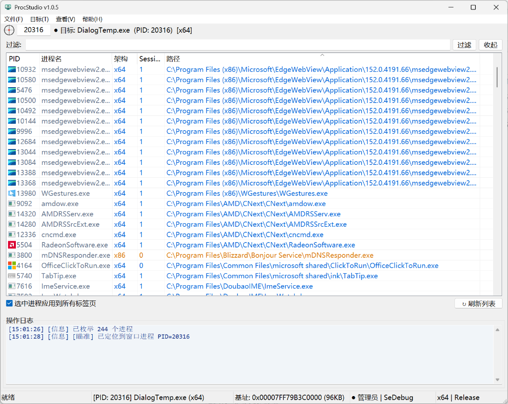
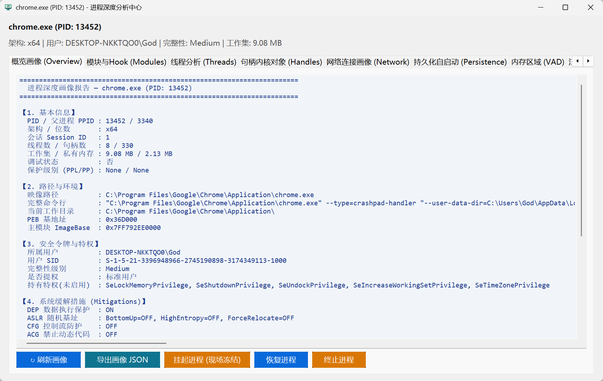
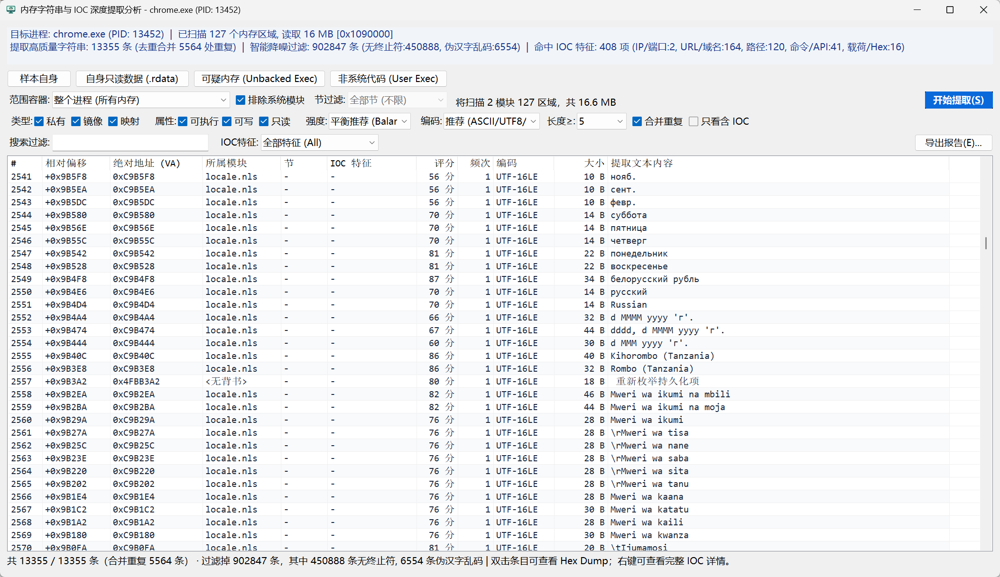
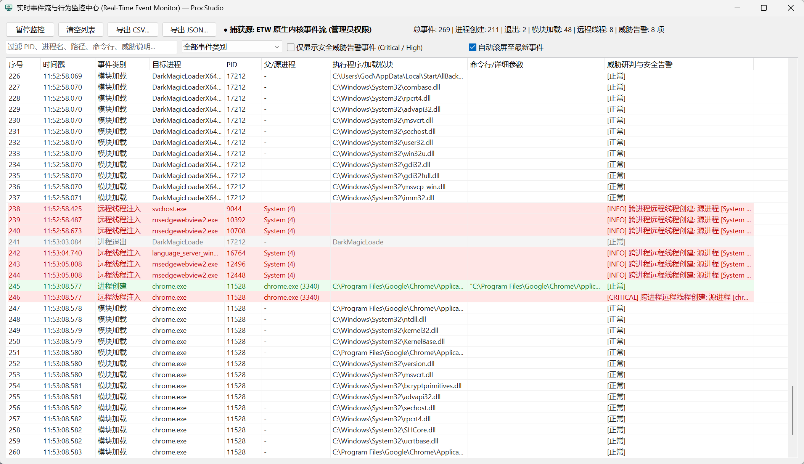
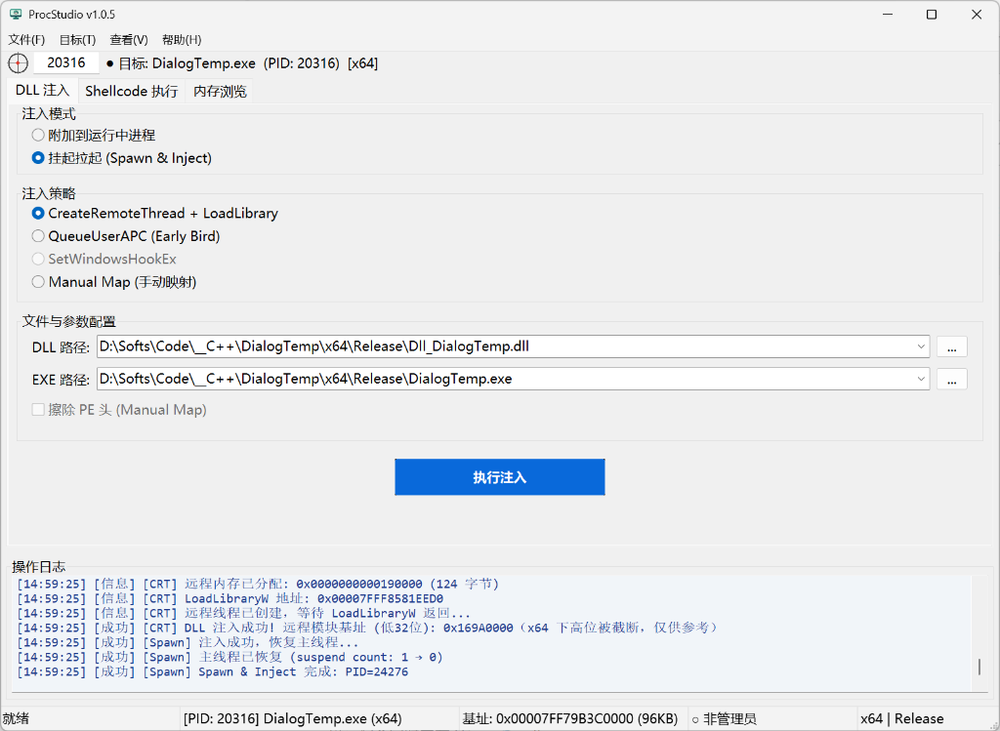
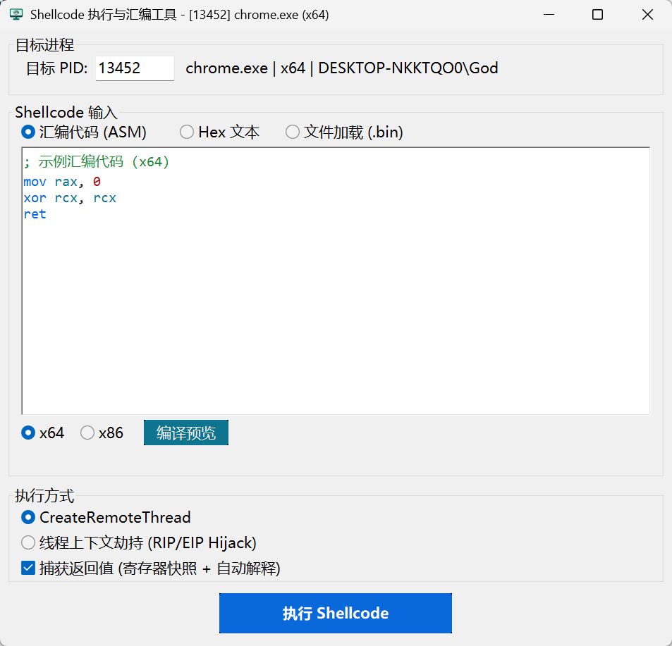
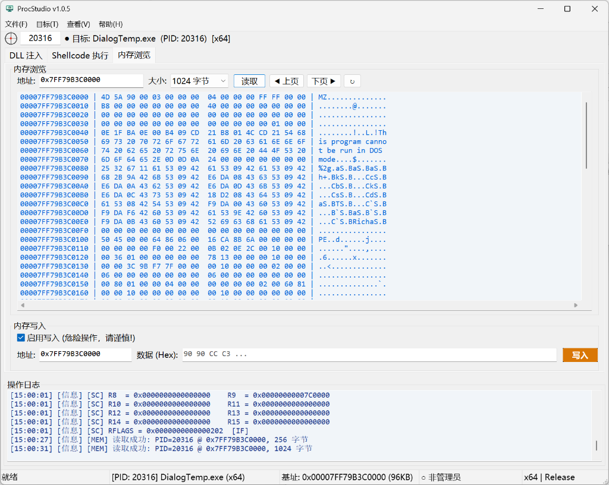
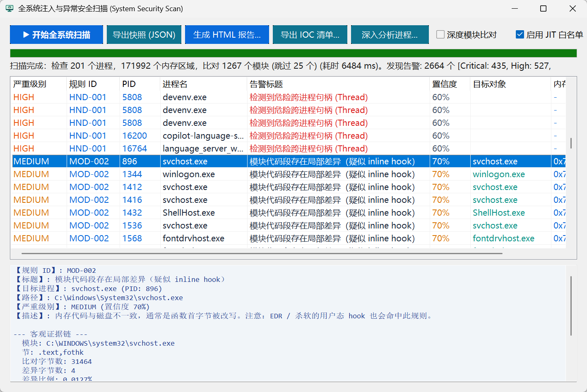

# ProcStudio（进程工作台）

### C++17 / Win32 原生实现的 Windows 进程分析、内存取证与测试工作台（单文件绿色版）

  
  
  
  
  
  
  

---

## 💡 项目简介

**ProcStudio（进程工作台）** 是一款面向逆向分析人员、安全研究人员与系统开发者的全功能 Windows 进程交互、载荷注入与内存调试工作台。

项目采用 **C++17 + 原生 Win32 API** 开发，静态链接 CRT（`/MT`）。发布包为单个独立 EXE，体积约 980KB；不依赖额外运行库，拷贝即可运行。设计重点是减少多工具之间的来回切换，同时保持足够轻量和可移植。

v1.0.8 进一步完善了进程画像、内存扫描、ETW 事件跟踪以及载荷测试相关模块。下面按功能和使用场景说明。

---

## 🌟 核心功能一览

- 🚀 **单文件、低依赖**：内嵌 32/64 位双架构消息钩子与 JIT 动态汇编引擎，无需额外 DLL，一个文件即可使用完整功能集。
- 🖥️ **原生 Win32 与 Per-Monitor V2 高 DPI**：适配 2K/4K 等高分屏缩放，保证界面、字体和图标的显示效果。
- 🎯 **准星定位进程**：将十字准星拖到任意桌面窗口即可锁定对应进程；定位期间可自动隐藏主窗口，避免遮挡。
- 🔍 **进程深度画像（Ctrl+D）**：从父子进程链、完整命令行、模块、线程、VAD 虚拟内存、跨进程句柄、网络连接和可疑内存段等维度集中查看进程状态。
- 🧩 **内存取证与 IOC 提取**：支持 ASCII、UTF-8、UTF-16LE/BE、UTF-32 等编码；可提取 IP、域名、URL、邮箱和敏感特征，并将选定内存区域导出为二进制文件。
- 🛡️ **ETW 实时行为监控（ProcSentry）**：直接订阅 Windows 内核遥测事件，不向目标进程注入代码，也不依赖 API Hook；可跟踪进程、线程、模块、文件和网络相关事件。
- 💉 **受控载荷测试（Ctrl+I）**：提供远程线程、QueueUserAPC、窗口消息钩子及手动映射等方式，用于授权环境下的兼容性与防护验证。
- ⚡ **Shellcode JIT 与寄存器快照（Ctrl+E）**：支持实时汇编、远程独立线程和线程上下文操作；执行后可查看通用寄存器快照及返回值语义。
- 🔧 **远程内存 Hex 查看与补丁（Ctrl+M）**：提供十六进制分页浏览、写入确认和内存保护恢复，便于定位和修改已授权目标的内存数据。

---

## 📸 界面预览（Screenshots）

|                 🎯 **全局进程面板与准星定位**                 |                  🔍 **进程多维深度分析中心**                  |
| :----------------------------------------------------------: | :----------------------------------------------------------: |
|  |  |
|                🧩 **内存脱壳取证与 IOC 提取**                 |                 🛡️ **内核 ETW 实时行为监控**                  |
|  |  |
|               💉 **多策略 DLL 注入与早鸟挂起**                |                ⚡ **Shellcode JIT 汇编与快照**                |
|  |  |
|              🔍 **远程内存 Hex Dump 与字节补丁**              |                 🏥 **系统全局体检与威胁扫描**                 |
|  |  |

---

## 🎯 典型使用场景

### 1. 分析加壳或无文件落地（Fileless）样本

- **场景**：目标样本落盘文件被多层加壳混淆，或者直接注入到了宿主进程的私有堆里无文件运行，查磁盘根本抓不到明文。
- **用法**：打开 **“内存取证与脱壳”**，范围指定仅扫描 `Private Commit`（私有堆栈），利用内置多编码解码一键把内存里解密出来的 C2 地址、域名、恶意配置全筛出来，还能直接把这段内存 Dump 存为 bin 扔进反编译工具。

### 2. 排查进程中的隐藏模块或异常行为

- **场景**：很多恶意代码会通过断链隐藏模块，常规任务管理器里根本看不出异常。
- **用法**：按下 `Ctrl + D` 打开 **“进程画像与深度分析中心”**，在模块与内存页里对比 PEB 链表和实际内存空间，辅助识别隐蔽注入的未挂接 DLL；看句柄页还能快速判断该进程是否持有针对 `lsass.exe` 等核心进程的高危跨进程注入句柄（系统自动标红预警）。

### 3. 进行授权安全演练或防护规则验证

- **场景**：想测试现场的 EDR/杀软对不同注入手段（如经典线程 vs 早鸟 APC vs 手动映射）的拦截效果。
- **用法**：用本工具的注入引擎轮流测试，配合自带的 **ProcSentry 内核遥测**，直观观察系统内核事件流是否告警，帮助完善防守基线。

### 4. 验证汇编代码或已授权的内存补丁

- **场景**：手写了一段 Shellcode，想验证返回值或者看寄存器状态，嫌开调试器太重。
- **用法**：切到“Shellcode 执行”标签页，直接手敲两行汇编（如 `mov rax, 0x123; ret`），点执行瞬间弹出寄存器快照弹窗，返回值还能自动翻译成可读中文解释；确认地址后还能在“内存浏览”中直接安全打上热补丁。

---

## 🛠️ 模块说明与快捷键

### 1. 进程画像与深度分析中心 (快捷键: `Ctrl + D`)

  

选定目标进程后，按下 **`Ctrl + D`**（或菜单【工具】➔【进程画像与深度分析中心】）：

- **概览**：查真实父进程 PID、完整启动命令行、环境变量块与权限级别；
- **模块**：查签名信息，自动对比高亮发现断链隐藏 DLL；
- **线程**：查入口点符号解析、挂起计数与 CPU 状态；
- **内存**：VAD 树直观浏览虚拟内存分配，标黄预警 `PAGE_EXECUTE_READWRITE` 代码段；
- **句柄**：检索全部内核句柄，内置跨进程权限规则引擎，高风险句柄以红色提示；
- **网络**：实时列出该进程持有的所有 TCP 连接与 UDP 端口。

---

### 2. 内存脱壳取证与 IOC 提取 (在内存浏览或进程分析中一键直达)

  

- 支持自由划定扫描范围（全部内存 / 仅私有提交 Private Commit / 仅可执行段）；
- **ASCII、UTF-8、UTF-16LE/BE、UTF-32** 多重编码并行扫描；
- 一键提取 IP、Domain、URL、邮箱、敏感注册表与敏感 API；
- 扫描结果支持一键复制，或直接 **Dump 为二进制文件**脱壳保存。

---

### 3. 基于内核 ETW 实时行为监控 (菜单【工具】➔【实时行为事件监控中心】)

  

- 纯 Windows 原生 ETW 机制，**0 注入、0 Hook、免驱动**，对目标系统完全无侵入；
- 实时截获全系统进程创建退出（带完整父进程 PID 与完整命令行）、驱动加载、跨进程线程与网络动态；
- 支持实时过滤与日志标准化导出。

---

### 4. 多模式载荷注入与早鸟执行 (快捷键: `Ctrl + I`)

  

- **挂起拉起 (Spawn & Inject)**：以挂起模式拉起目标程序，在入口点代码运行前注入并恢复，支持自定义工作路径和参数；
- **CreateRemoteThread**：常用的标准注入方式；
- **QueueUserAPC**：轻量异步注入，与挂起拉起结合即为经典的**早鸟注入 (Early Bird)**；
- **SetWindowsHookEx**：通过消息钩子注入有界面程序，内嵌 32/64 位双架构组件，无需携带外部 DLL；
- **Manual Map (手动映射)**：纯内存展开 PE、重定位与 IAT 修复，支持抹 PE 头防检。

---

### 5. Shellcode 动态 JIT 与寄存器快照 (快捷键: `Ctrl + E`)

  

- 支持 **十六进制字节流**、**Bin 镜像文件**、**直接写汇编代码 (Live ASM)** 任意切换；
- 支持创建独立远程线程或**劫持目标线程上下文 (RIP/EIP)**；
- 内置 **16 字节动态栈对齐保护**，调用包含 SSE/浮点指令或 Win32 API 时保持稳定；
- 执行后弹出**紧凑精致的寄存器快照弹窗**（RAX/RBX/RCX/RDX/RFLAGS 等），返回值自动翻译（如 `[NULL / FALSE]`、`[TRUE]`、指针及字符串回读预览），并可一键直达内存浏览。

---

### 6. 远程内存查看与热补丁 (快捷键: `Ctrl + M`)

  

- 输入 16 进制虚拟地址秒级定位，支持 64B ~ 4096B 分页浏览；
- 经典 Hex Dump 界面，十六进制与 ASCII 码对照清晰；
- 写入补丁带安全防误触确认锁，自动对只读代码段提权与还原。

---

## 🚀 快速上手

1. **下载**：获取单文件 `ProcStudio.exe`（体积不到 1MB）；
2. **提权**：右键点击 `ProcStudio.exe`，选择 **【以管理员身份运行】**（跨进程分析与内核 ETW 必需 `SeDebugPrivilege` 特权）；
3. **定位目标**：在搜索栏敲进程名，或按住右上角“十字准星”拖到目标窗口上松手；
4. **开始使用**：按需通过快捷键打开【进程分析中心 (Ctrl+D)】、【测试工具 (Ctrl+I)】、【Shellcode 工作台 (Ctrl+E)】和【内存编辑 (Ctrl+M)】。

---

## ❓ 常见问题（FAQ）

**Q1：为什么有的杀软可能会提示风险或报毒？**

> **A**：跨进程内存操作相关 API（如 `VirtualAllocEx`、`WriteProcessMemory`、`CreateRemoteThread`）本身就是安全产品的重点监测对象，因此可能产生风险提示。建议先在隔离测试环境中验证，并按组织的安全策略处理告警。

**Q2：提示“拒绝访问”或错误码 5（`ERROR_ACCESS_DENIED`）是怎么回事？**

> **A**：先确认是否已经以管理员身份运行。如果是针对 `csrss.exe` 等系统核心进程、启用了 PPL 保护的进程或者带有反作弊驱动的游戏，用户态工具受 Windows 内核保护限制是无法直接打开操作的，这属于正常系统防护表现。

**Q3：向 32 位（WOW64）程序注入需要注意什么？**

> **A**：工具本身是 64 位程序，但已经内置了跨架构支持。如果目标是 32 位程序，推荐选择 **Manual Map（已内建 x86 映射引擎）** 或 **SetWindowsHookEx（已内建 32 位辅助代理）** 即可正常注入。

**Q4：为什么不用现成的框架做界面？**

> **A**：项目选择原生 Win32 + C++17，主要是为了控制启动开销、部署体积和运行依赖。完整功能被整合在一个不到 1MB 的 EXE 中，方便放入应急或分析工具集。

---

## ⚠️ 免责声明

1. 本软件仅供**网络安全合规研究、计算机逆向工程教学、漏洞挖掘验证、合法授权的应急响应取证及软件插件二次开发**学习交流使用。
2. 严禁利用本工具从事任何未经授权的入侵破坏、非法篡改数据、传播恶意代码等违法违规行为。
3. 使用者因违规使用本工具所产生的一切直接或间接法律责任及后果，均由使用者自行承担，软件原作者概不承担任何法律责任。
4. 下载、运行本工具即代表您完全理解并自愿遵守本声明的所有条款。

---

**欢迎下载体验并在帖子中反馈问题、使用建议或改进想法。**

